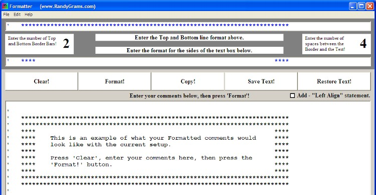



## Formatter

### Description

Format groups of comments into neat looking comment boxes.

I cheat! One comment that I frequently get regarding my programs is "How nicely they are Commented and Formatted". Well, I cheat! And now I'm going to show you how so you can have nice looking programs that are easy to read.

Are you constantly re-writing comments in your VB code? I know I am! PSC is a fantastic VB resource but many of the comments that I see in source code are hard to read due to the way that they are formated. That's one reason why I wrote Formatter.

Formatter uses your text to build Professional looking Comment Boxes to paste into your Visual Basic programs. You may also input a Text file, if you want. Formatter can be used to reformat any text that you want. It makes the source code much easier to read and debug. It will also aid you in making all of your programs look consistent. It is heavily commented and should be easy to modify to suit your own personal tastes.

Whoops! I uploaded with a bad reference. The corrected VBP has now been uploaded. Sorry for any problems.
 
### More Info
 
Enter any text that you want. You may cut & paste text from your current programs if you wish. The program will insert the tick marks(') for you, so you don't need to worry about that.

You end up with neater looking source code.

             |
---                |---
**Submitted On**   |2010-05-12 15:19:24
**By**             |[Randy Giese](https://github.com/Planet-Source-Code/PSCIndex/blob/master/ByAuthor/randy-giese.md)
**Level**          |Intermediate
**User Rating**    |4.8 (19 globes from 4 users)
**Compatibility**  |VB 6\.0
**Category**       |[Miscellaneous](https://github.com/Planet-Source-Code/PSCIndex/blob/master/ByCategory/miscellaneous__1-1.md)
**World**          |[Visual Basic](https://github.com/Planet-Source-Code/PSCIndex/blob/master/ByWorld/visual-basic.md)
**Archive File**   |[Formatter2182145312010\.Zip](https://github.com/Planet-Source-Code/randy-giese-formatter__1-68718/archive/master.zip)

